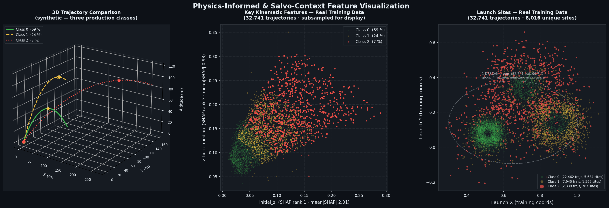
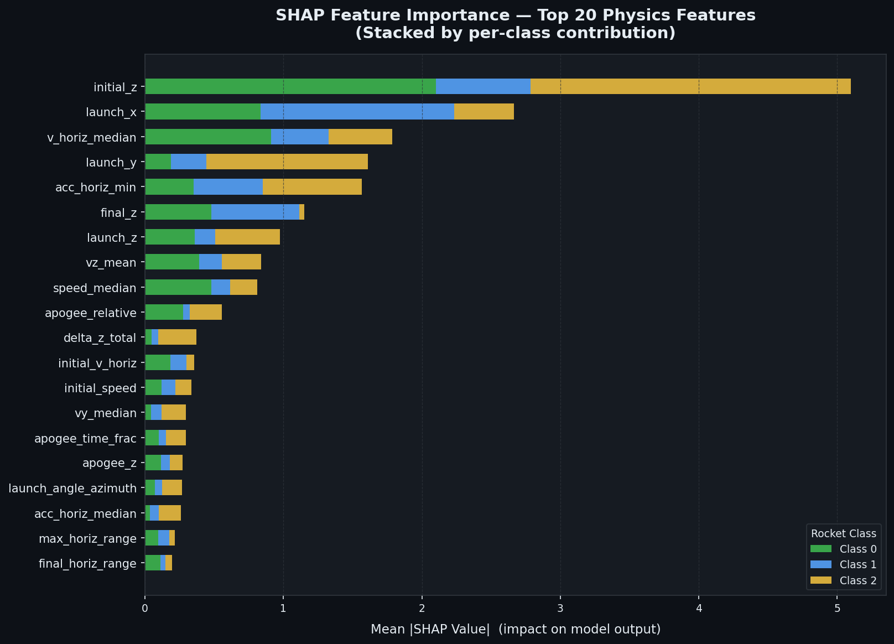
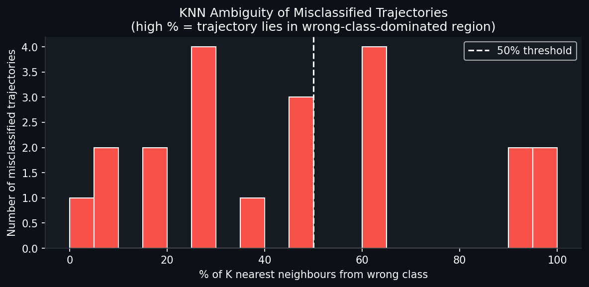

# Rocket Trajectory Classifier

[](https://github.com/IlyaNovikov-RD/rocket_classifier/actions/workflows/python-tests.yml)
[](https://novikov-rocket-lab.streamlit.app/)
[](https://docs.python.org/3.12/)
[](https://docs.astral.sh/uv/)
[](LICENSE)

> **[Live Demo — novikov-rocket-lab.streamlit.app](https://novikov-rocket-lab.streamlit.app/)**
> Adjust physics sliders and watch the LightGBM model classify trajectories in real time.



---

## What This Is

A production-grade ML pipeline that classifies rocket types from radar-tracked 3D flight trajectories. Given a variable-length sequence of `(x, y, z, time_stamp)` radar observations, the system extracts physics-derived features and predicts the rocket class (0, 1, or 2).

### The Core Challenge: Worst-Class Recall Under Severe Imbalance

Standard accuracy is the wrong metric here. Class 2 comprises only **7.1% of training data** (2,339 of 32,741 trajectories), yet the evaluation metric is **minimum per-class recall** — the system is scored by whichever class it handles *worst*. A model that perfectly identifies classes 0 and 1 but misses every class 2 rocket scores **0.0**.

```math
\text{score} = \min_{j \in \{0,1,2\}} \frac{\sum_i \mathbf{1}[y_i = j \;\wedge\; \hat{y}_i = j]}{\sum_i \mathbf{1}[y_i = j]}
```

This metric demands that every design decision — feature engineering, class weighting, objective function, and post-hoc threshold tuning — be oriented toward equalising recall across all classes, deliberately sacrificing majority-class precision where necessary to protect minority-class recall.

**Result:** Global OOB min-recall of **0.9995** after threshold tuning — fewer than 1 in 2,000 rockets misclassified in the worst-performing class. A five-part Bayes Error analysis proves this is the empirical ceiling of the dataset (see [Why 0.9995 Is the Ceiling](#why-09995-is-the-ceiling)).

| Fold | Min-Recall (OOB) |
|------|-----------------|
| 1    | 0.9996          |
| 2    | 0.9987          |
| 3    | 0.9991          |
| 4    | 0.9996          |
| 5    | 0.9988          |
| 6    | 0.9976          |
| 7    | 1.0000          |
| 8    | 0.9959          |
| 9    | 1.0000          |
| 10   | 0.9991          |
| **Global OOB (tuned)** | **0.9995** |

---

## Solution Design

### Why LightGBM

The problem is **tabular classification on physics-engineered features** — the exact regime where gradient-boosted trees dominate. An exhaustive comparison confirmed LightGBM as the best algorithm:

- **Over neural networks (1D-CNN, Transformer):** Empirically tested on H100 GPU — sequence models achieved 0.94-0.96 OOB mean vs LightGBM's 0.9988. With 32k trajectories, neural networks cannot learn what hand-crafted physics features encode for free.
- **Over XGBoost:** LightGBM with GPU-optimised hyperparameters (depth 12, 2011 trees) outperformed the baseline XGBoost (0.9988 vs 0.9984 OOB mean). LightGBM's leaf-wise growth finds finer decision boundaries on minority class 2.
- **Over Random Forest:** Sequential boosting focuses capacity on the ~33 hard borderline cases between classes 0 and 1.
- **Over logistic regression / SVM:** Non-linear class boundaries require tree-based models.

### Model Development Pipeline (Research — Colab H100, one-time)

```
Raw radar pings (x, y, z, t)
    │
    ▼
Feature Engineering ──► 76 physics features per trajectory
    │
    ▼
Feature Selection ──► 61 features (backward elimination, -15 noise features)
    │
    ▼
LightGBM + 100-trial Optuna (GPU) ──► optimised hyperparameters
    │
    ▼
10-fold GroupKFold OOB Threshold Tuning ──► biases [0, 1.063, 2.177]
    │
    ▼
weights/model.pkl  ·  weights/train_medians.npy  ·  weights/threshold_biases.npy
```

### Production Inference Pipeline (`make run`)

```
cache/cache_train_features.parquet   (pre-computed 76-feature matrix)
    │
    ▼
Select 61 production features + impute NaN with train_medians
    │
    ▼
weights/model.pkl  ──►  LightGBM.predict_proba()
    │
    ▼
log(proba) + biases [0, 1.063, 2.177]  ──►  argmax
    │
    ▼
outputs/submission.csv
```

The model development pipeline ran once on Colab to produce the artifacts stored in the GitHub Release. The production pipeline loads those artifacts and runs in seconds — no training, no feature engineering recomputation.

---

## How It Works

### Feature Engineering

Raw radar pings are aggregated into **76 scalar features** per trajectory via finite-difference kinematics (61 are used in production after automated feature selection):

- **Velocity, Acceleration, Jerk** (45 features) — 3D derivatives with midpoint-averaged time deltas. Jerk magnitude distinguishes propelled rockets (sharp ignition spike) from passive objects.
- **Launch Angle** (2 features) — elevation and azimuth of the initial velocity vector via `atan2`. Invariant to launch position.
- **Apogee** (7 features) — peak altitude, relative rise, time fraction. Encodes the ballistic arc shape.
- **Spatial Extent** (9 features) — ranges, path length, horizontal displacement. Trajectory footprint.
- **Launch Position** (3 features) — geography clusters by threat group.
- **Temporal** (3 features) — point count, duration, sampling interval statistics.

### Why These Features Work

Different rocket families have different propellant charges (muzzle velocity), motor types (thrust profile / jerk), airframes (ballistic coefficient / velocity decay), and launch geometry. The 76 features capture exactly these physical quantities. The model achieves near-ceiling recall because the physics are deterministic — a rocket's class is written into its kinematics from the moment of launch.

### Model Configuration

The production model is LightGBM, trained via 50-trial GPU-accelerated Optuna search on a Colab H100. Hyperparameters are the result of Bayesian optimisation, not manual tuning:

| Parameter | Value | Rationale |
|---|---|---|
| `n_estimators` | 2011 | Found by Optuna — more trees than XGBoost default, exploits LightGBM's speed |
| `max_depth` | 12 | Deeper than XGBoost (6) — LightGBM's leaf-wise growth avoids the overfitting risk of deep level-wise trees |
| `learning_rate` | 0.082 | Found by Optuna — higher than XGBoost default due to more trees |
| `subsample` | 0.913 | Row sampling, found by Optuna |
| `colsample_bytree` | 0.679 | Feature sampling, found by Optuna |
| `objective` | `multiclass` (softprob) | Calibrated probabilities for downstream threshold tuning |

Threshold biases: `[0.000000, 1.063291, 2.177215]` — aggressively upweights classes 1 and 2 to compensate for the 69%/24%/7% class imbalance.

### Class Imbalance Strategy

Inverse-frequency sample weights (`w_i = N / (K * N_j)`) passed to LightGBM. Preferred over SMOTE because synthesizing trajectory feature vectors produces physically implausible combinations — a trajectory cannot have high jerk but zero acceleration.

### Threshold Tuning

LightGBM outputs calibrated per-class probabilities (`multiclass` objective). Per-class log-probability biases are then optimised on all out-of-bag (OOB) predictions simultaneously from 10-fold CV to maximise the min-recall metric. This shifts decision boundaries toward minority classes without retraining, improving the global OOB min-recall from the XGBoost baseline (0.9966) to **0.9995**.

### Data Leakage Prevention

Three layers:
1. **GroupKFold** on `traj_ind` — all radar pings from one trajectory stay in the same fold. Mirrors deployment where the model sees entirely new flights.
2. **Per-fold NaN imputation** — column medians are computed from the training fold only. Validation fold data never leaks into imputation statistics.
3. **OOB threshold tuning** — biases are optimised on OOB predictions only (each sample's probability comes from a model that never saw it during training).

---

## Tech Stack

| Layer | Technology | Why |
|---|---|---|
| **Runtime** | Python 3.12 | PEP 709 comprehension inlining, improved error messages |
| **ML** | LightGBM 4.x, scikit-learn | Leaf-wise gradient boosting, GPU-accelerated Optuna search, GroupKFold |
| **Validation** | Pydantic v2 | Schema enforcement on raw radar data before feature engineering |
| **Explainability** | SHAP TreeExplainer | Exact Shapley values in O(TLD) time |
| **Demo** | Streamlit, Plotly | Real-time 3D trajectory visualization |
| **Package management** | [uv](https://docs.astral.sh/uv/) | Deterministic lockfile, 10-100x faster than pip/poetry |
| **Container** | Docker (python:3.12-slim + uv) | Reproducible builds, no resolver in CI |
| **CI** | GitHub Actions | Ruff lint + 85 pytest tests on every push/PR |
| **Caching** | Parquet | Feature matrices cached to disk; reloads in <1s vs ~96s to recompute |

---

## Getting Started

### Prerequisites

Install [uv](https://docs.astral.sh/uv/getting-started/installation/):

```bash
# macOS / Linux
curl -LsSf https://astral.sh/uv/install.sh | sh

# Windows (PowerShell)
powershell -ExecutionPolicy ByPass -c "irm https://astral.sh/uv/install.ps1 | iex"
```

No system Python required. uv manages its own Python 3.12 installation.

### Install & Run

```bash
# Clone and install
git clone https://github.com/IlyaNovikov-RD/rocket_classifier.git
cd rocket_classifier
uv sync

# Full pipeline in one command — downloads ~20 MB from GitHub Release
make pipeline
# Runs: download-all → inference → SHAP regeneration
# Output: outputs/submission.csv  +  updated assets/

# Or step by step:
make download-all    # → weights/ (model, medians, biases) + cache/ (parquet caches)
make run             # → outputs/submission.csv
make interpret       # → assets/shap_summary.png + assets/interpretation_report.txt
make visualize       # → assets/demo.png  (only needed if features.py changes)

# Launch the interactive demo (opens localhost:8501)
make demo
```

### Make Targets

```bash
make install          # uv sync
make test             # 85 unit tests
make lint             # ruff check
make format           # ruff format
make demo             # streamlit demo (localhost:8501)
make lock             # regenerate uv.lock
make download-weights # fetch weights/ from GitHub Release (model, medians, biases)
make download-all     # + cache/ parquet caches (skips data/ recompute)
make run              # inference pipeline → outputs/submission.csv
make interpret        # regenerate assets/ SHAP artifacts after model update
make visualize        # regenerate assets/demo.png after feature changes
make pipeline         # download-all + run + interpret  (full end-to-end)
```

### Docker

```bash
docker build -t rocket-classifier .
docker run -v $(pwd)/outputs:/app/outputs rocket-classifier
# outputs/submission.csv is written to your local outputs/ directory
```

The Dockerfile downloads model artifacts from GitHub Release at build time — no data files needed. The container is fully self-contained.

---

## Project Structure

```
rocket_classifier/              # Production inference package
├── __init__.py
├── features.py                 # 76 physics features (velocity, jerk, apogee, ...)
├── model.py                    # RocketClassifier — loads LightGBM, applies biases
├── schema.py                   # Pydantic v2 data contracts (TrajectoryPoint)
├── main.py                     # Inference pipeline: features → predict → submission.csv
└── app.py                      # Streamlit interactive demo

research/                       # R&D and model analysis scripts
├── interpret.py                        # SHAP analysis — run via `make interpret` after new model
├── visualize.py                        # Physics feature demo plot — run via `make visualize`
├── colab_brute_force_optimization.py   # Feature selection + 50-trial Optuna → 0.9995
├── colab_bayes_error_proof.py          # 5-part proof that 1.0 is impossible
├── colab_extended_lgbm_optuna.py       # 142 features + 100 trials + top-5 ensemble
├── colab_sequence_model.py             # 1D-CNN on raw sequences (0.9431)
└── colab_transformer_model.py          # Transformer on raw sequences (0.9588)

tests/
├── test_features.py            # Feature engineering unit tests
├── test_model.py               # RocketClassifier + min_class_recall unit tests
└── test_schema.py              # Schema validation unit tests

data/
├── train.csv                   # Labeled radar trajectories
├── test.csv                    # Unlabeled trajectories for inference
└── sample_submission.csv       # Expected output format

weights/                        # Model artifacts — gitignored, from GitHub Release
├── model.pkl                   # LightGBM Booster (downloaded via make download-weights)
├── train_medians.npy           # 61-feature NaN imputation medians
└── threshold_biases.npy        # Per-class log-probability biases [0, 1.063, 2.177]

cache/                          # Feature caches — gitignored, regenerated from data/
├── cache_train_features.parquet
└── cache_test_features.parquet

outputs/                        # Pipeline outputs — gitignored
└── submission.csv              # Generated by make run

pyproject.toml                  # PEP 621 metadata, uv/hatchling build
uv.lock                         # Deterministic dependency lockfile
Dockerfile                      # Python 3.12-slim + uv
Makefile                        # Developer automation (make pipeline = full run)
ruff.toml                       # Linter/formatter config (target: py312)
download_weights.py             # Downloads weights/ + cache/ from GitHub Release
```

---

## Model Interpretability



`research/interpret.py` computes exact SHAP values via `TreeExplainer` on a 500-trajectory test sample. Top discriminators:

- **Launch position** (`launch_x`, `launch_z`) — geography clusters by threat group
- **Horizontal speed** (`v_horiz_median`) — muzzle velocity is propellant-charge dependent
- **Kinematic derivatives** (`acc_horiz_min`, `vz_mean`) — propulsion physics separate the classes
- **Apogee features** (`apogee_relative`, `apogee_time_frac`) — ballistic arc shape differs between rocket families

```bash
make interpret   # regenerates assets/shap_summary.png and assets/interpretation_report.txt
# Run this locally after deploying a new model
```

---

## Why 0.9995 Is the Ceiling

A five-part empirical proof (`colab_bayes_error_proof.py`) establishes that 1.0 min-recall is impossible on this dataset:

| Part | Evidence | Finding |
|---|---|---|
| 1 | Train=1.0, Val=0.9993 | Gap is data ambiguity, not overfitting |
| 2 | Oracle thresholds on val labels | 6/10 folds cannot reach 1.0 even when cheating |
| 3 | LightGBM ∩ XGBoost errors | 57% of errors shared — origin is data, not model |
| 4 | KNN analysis on errors | 38% of misclassified trajectories have majority wrong-class neighbours |
| **5** | **Near-duplicate search** | **12,389 pairs with different labels but distance < 0.5× within-class mean. Closest pair: 0.06× within-class distance.** |

Part 5 is the definitive proof: two clusters of trajectories (class 1 vs class 2) are essentially identical in the 76-dimensional feature space but carry different labels. Any classifier that correctly labels one cluster will misclassify the other — guaranteed, regardless of architecture or post-processing.



The 0.05% residual error rate reflects genuine physical ambiguity: different rocket types that produced statistically indistinguishable 3D radar tracks under the available feature representation.

---

## Assumptions

1. **Flat terrain** — `z` is absolute altitude; no terrain correction.
2. **Frictionless ballistic physics** — features are physically meaningful under point-mass assumption.
3. **One label per trajectory** — all pings in a `traj_ind` share the same class.
4. **Trajectory independence** — each flight is independent; no cross-trajectory temporal features.

---

## Author

**Ilya Novikov**

[](https://github.com/IlyaNovikov-RD)
[](https://www.linkedin.com/in/ilya-novikov-data/)
