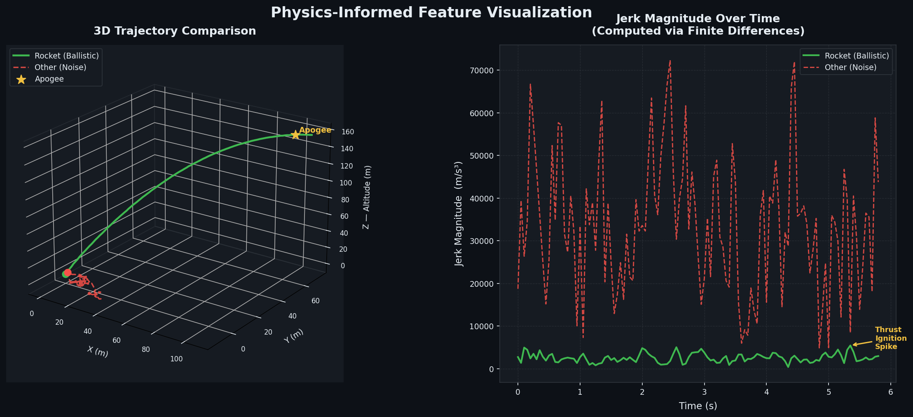
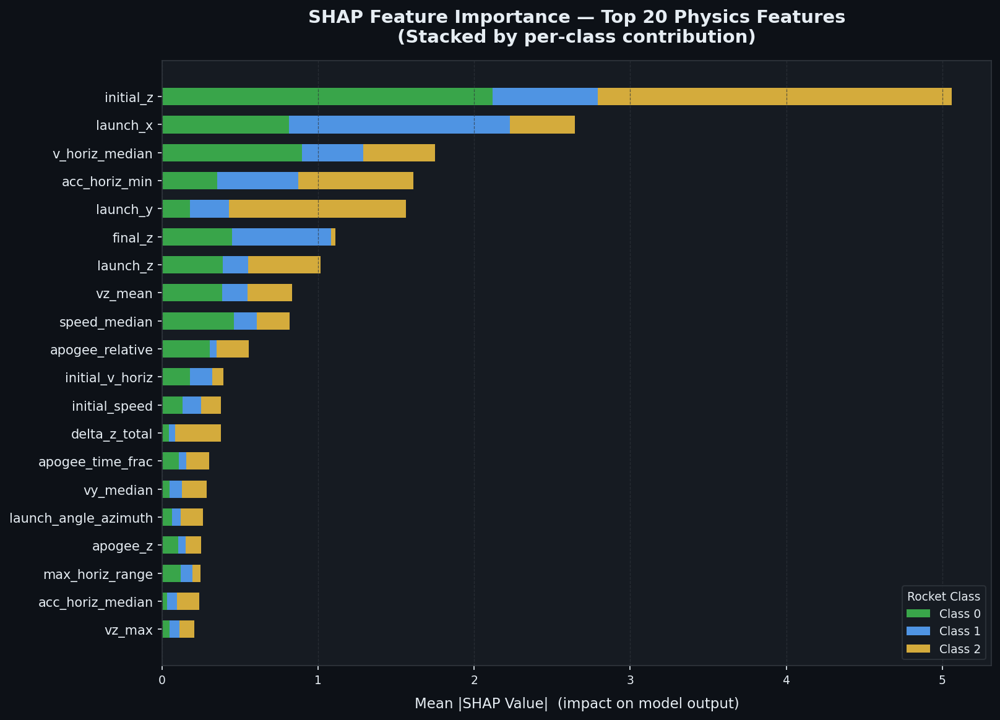

# Rocket Trajectory Classifier



A production-grade machine learning pipeline that classifies rocket types from radar-tracked 3D trajectory data. Given a sequence of positional readings `(x, y, z, time_stamp)` for a single trajectory, the model predicts the rocket class (0, 1, or 2) as early as possible — enabling threat assessment and response prioritization.

---

## Project Structure

```
rocket_classifier/
├── data/
│   ├── train.csv                  # Labeled trajectory point data
│   ├── test.csv                   # Unlabeled trajectory point data
│   └── sample_submission.csv      # Expected submission format
├── src/
│   ├── schema.py                  # Pydantic data contracts (TrajectoryPoint)
│   ├── features.py                # Physics-based feature engineering
│   ├── model.py                   # XGBoost classifier + CV evaluation
│   ├── main.py                    # Pipeline orchestrator
│   ├── app.py                     # Streamlit interactive demo
│   └── interpret.py               # SHAP model interpretability
├── Makefile                       # Developer automation (install/test/lint/demo)
├── pyproject.toml                 # Poetry dependency manifest
├── poetry.lock                    # Pinned dependency versions
├── Dockerfile                     # Containerized runtime
└── submission.csv                 # Generated output (after pipeline run)
```

---

## Quickstart

### Option 0 — Makefile (recommended)

**Prerequisites:** Python 3.11+, [Poetry](https://python-poetry.org/docs/#installation), `make`

All common workflows are covered by a single `Makefile` in the project root:

```bash
make install   # Install all dependencies into the Poetry virtualenv
make test      # Run the full pytest suite (55 unit tests)
make lint      # Check code quality with ruff
make format    # Auto-format all source files with ruff
make demo      # Launch the Streamlit interactive demo at localhost:8501
```

Run the full pipeline (feature engineering → training → submission):

```bash
poetry run python src/main.py   # generates submission.csv and model.pkl
make demo                       # launch the live demo once model.pkl exists
```

> **Windows users:** `make` is available via [Git for Windows](https://gitforwindows.org/),
> [Chocolatey](https://chocolatey.org/) (`choco install make`), or
> [winget](https://learn.microsoft.com/en-us/windows/package-manager/) (`winget install GnuWin32.Make`).

---

### Option 1 — Local (Poetry)

**Prerequisites:** Python 3.11+, [Poetry](https://python-poetry.org/docs/#installation)

```bash
# Install dependencies
poetry install

# Run the full pipeline
poetry run python src/main.py
```

Feature matrices are cached to `cache_train_features.parquet` and `cache_test_features.parquet` after the first run. Subsequent runs skip feature engineering and go straight to training (~4 min vs. ~6 min full).

Output: `submission.csv` in the project root.

---

### Option 2 — Interactive Web Demo (Streamlit)

After running the pipeline once (to train and save `model.pkl`), launch the
interactive demo in your browser:

```bash
poetry run streamlit run src/app.py
```

The app opens at `http://localhost:8501` and lets you:

- **Drag sliders** for *Initial Speed*, *Thrust Acceleration*, and *Measurement Noise*
- Watch the **Plotly 3D trajectory** update in real time as parameters change
- See the **predicted class** and **confidence score** recalculated on every slider move
- Compare **per-class probability bars** for all three rocket classes

> **Note:** `model.pkl` is generated automatically at the end of `src/main.py`.
> Run the full pipeline at least once before launching the demo.

---

### Option 3 — Docker

**Prerequisites:** [Docker](https://docs.docker.com/get-docker/)

```bash
# Build the image
docker build -t rocket-classifier .

# Run the pipeline
# Mount a host directory to retrieve submission.csv after the run
docker run --rm \
  -v "$(pwd)/submission_output:/app/submission_output" \
  rocket-classifier
```

> **Note:** To write `submission.csv` to your host machine, update the output path in `src/main.py` to `/app/submission_output/submission.csv`, or copy it out after the run:
> ```bash
> docker run --name rc rocket-classifier
> docker cp rc:/app/submission.csv ./submission.csv
> docker rm rc
> ```

---

### Running Tests

The project includes a comprehensive suite of 55 unit tests in `tests/test_features.py`, written with `pytest`. The tests bulletproof the physics feature engineering against edge cases including vertical launches (where a naive `atan(vz/v_horiz)` would divide by zero, but `np.arctan2` handles correctly), duplicate timestamps (`dt=0`), zero-velocity states, and trajectories as short as a single radar ping. Key invariants — such as every trajectory always producing the full set of 76 feature keys regardless of length — are explicitly asserted.

```bash
poetry run pytest
```

---

## Evaluation Metric

The official metric is **minimum per-class recall** across all rocket types:

```math
\text{score} = \min_{j \in \{0,1,2\}} \frac{\sum_i \mathbf{1}[y_i = j \wedge \hat{y}_i = j]}{\sum_i \mathbf{1}[y_i = j]}
```

This penalizes models that perform well on average but fail on any single class. A model that perfectly classifies classes 0 and 1 but misses every class 2 rocket scores **0.0**.

### Cross-Validation Results

| Fold | Min-Recall | Class 0 | Class 1 | Class 2 |
|------|-----------|---------|---------|---------|
| 1    | 0.9915    | 1.000   | 0.998   | 0.992   |
| 2    | 0.9978    | 0.999   | 0.999   | 0.998   |
| 3    | 0.9958    | 0.999   | 1.000   | 0.996   |
| 4    | 0.9958    | 0.999   | 0.998   | 0.996   |
| 5    | 0.9934    | 1.000   | 0.998   | 0.993   |
| **CV** | **0.9949 ± 0.0022** | | | |

---

## Model Interpretability



The project includes a full interpretability pipeline (`src/interpret.py`) powered by **SHAP (SHapley Additive exPlanations)**. After training, `TreeExplainer` computes exact Shapley values for a representative sample of test trajectories and produces the stacked bar chart above, broken down by per-class contribution.

**Key findings from SHAP analysis:**

- **Launch position (`launch_x`, `launch_z`)** and **horizontal speed (`v_horiz_median`)** are the dominant features — launcher geography and muzzle velocity are the strongest class discriminators, consistent with the business context (different rebel groups with independent rocket supplies).
- **Kinematic derivative features** (`acc_horiz_min`, `vz_mean`, `speed_median`) rank in the top 10, confirming that propulsion physics — not just trajectory shape — are what separates rocket classes.
- **Apogee-related features** (`apogee_relative`, `apogee_time_frac`) appear mid-table, consistent with ballistic arc differences between rocket families.

To regenerate the SHAP analysis:

```bash
poetry run python src/interpret.py
```

This produces `shap_summary.png` and `interpretation_report.txt` in the project root.

---

## Key Architectural Decisions

### 1. Vectorized Physics Feature Engineering (`src/features.py`)

Raw data is point-level (one row per radar ping). The pipeline aggregates each trajectory into a single feature vector using physics-derived quantities:

- **3D Velocity, Acceleration, Jerk** — computed via finite differences on `(x, y, z)` over time deltas derived from `time_stamp`. All three orders of derivative are captured as per-trajectory statistics (mean, std, min, max, median).
- **Launch Angle** — elevation angle (`atan2(vz, v_horiz)`) and azimuth (`atan2(vy, vx)`) of the initial velocity vector. Different rocket types have characteristic launch profiles.
- **Apogee and Time-to-Apogee** — maximum altitude reached (`max(z)`) and the fractional trajectory position at which it occurs. Ballistic arc shape is a strong discriminator between rocket classes.
- **Horizontal Range, Path Length, Spatial Extent** — capture the overall footprint and energy of the trajectory.

All computations are fully vectorized with NumPy; no per-row Python loops.

---

### 2. Data Leakage Prevention (`src/model.py`)

A naive train/test split on individual rows would allow the model to see points from the same trajectory in both train and validation sets — giving artificially inflated scores that do not generalize.

**Solution:** `sklearn.model_selection.GroupKFold` with `traj_ind` as the group key. Every fold guarantees that all points belonging to a given trajectory appear exclusively in either the training set or the validation set — never both. This mirrors real-world deployment where the model encounters entirely unseen trajectories.

---

### 3. Imbalanced Data Handling (`src/model.py`)

The training set is heavily skewed: class 0 (69%), class 1 (24%), class 2 (7%). Because the metric is minimum recall, a model that ignores class 2 is useless regardless of overall accuracy.

**Solution:** Inverse-frequency sample weights passed to `XGBClassifier.fit()`:

$$w_i = \frac{N}{K \cdot N_j} \quad \text{where } j = \text{class of sample } i$$

This approach was preferred over SMOTE (synthetic oversampling) because:
- SMOTE on trajectory-level features can generate physically implausible feature combinations.
- Sample weights are natively supported by XGBoost with zero preprocessing overhead.
- It avoids inflating the dataset size, which keeps training time predictable.

---

### 4. Custom Min-Recall Metric (`src/model.py`)

`sklearn`'s built-in scorers do not directly implement the min-recall objective. A custom scorer was implemented and used consistently throughout cross-validation:

```python
def min_class_recall(y_true, y_pred):
    recalls = [recall_score(y_true, y_pred, labels=[j]) for j in unique_classes]
    return min(recalls)
```

Per-fold logging includes both the aggregate score and the per-class breakdown, making it immediately visible if any class degrades.

---

### 5. Parquet Feature Caching (`src/main.py`)

Feature engineering over 32,741 training trajectories takes ~96 seconds. To enable fast iteration during model development (hyperparameter tuning, feature ablation), the pipeline writes the computed feature matrices to Parquet files on first run:

```
cache_train_features.parquet
cache_test_features.parquet
```

On subsequent runs, the pipeline detects these files and skips feature engineering entirely, reducing total runtime from ~6 minutes to ~4 minutes. Parquet was chosen over CSV for its columnar compression and exact dtype preservation (no float precision loss on reload).

To force a full recompute, delete the cache files before running.

---

## Assumptions

The following assumptions were made explicitly (as required by the assignment):

1. **Flat terrain**: Shtuchia has no mountains or valleys. The `z` coordinate represents absolute altitude with no terrain correction required.
2. **Standard ballistic physics**: Rockets follow frictionless point-mass trajectories. Derived features (apogee, launch angle) are physically meaningful under this assumption.
3. **One label per trajectory**: All points in a trajectory share the same `label`. The label is taken from the first row of each group.
4. **Trajectory independence**: Each `traj_ind` represents a fully independent flight. No cross-trajectory temporal features are engineered.
